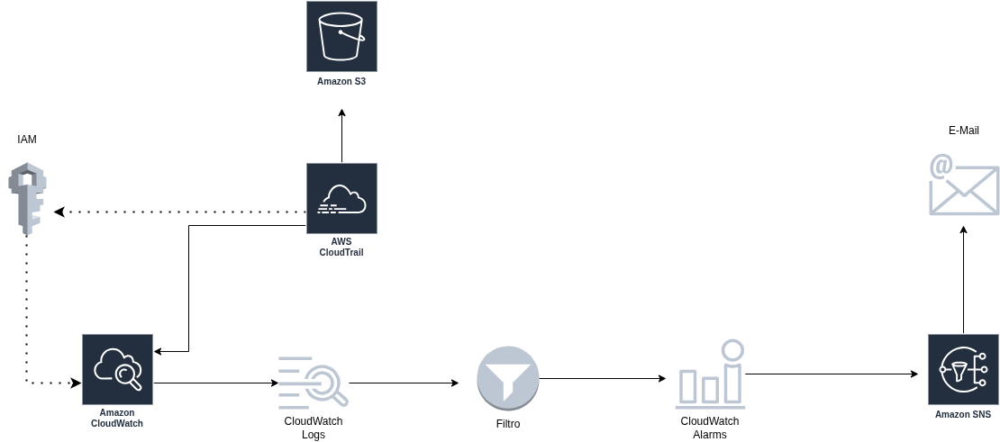
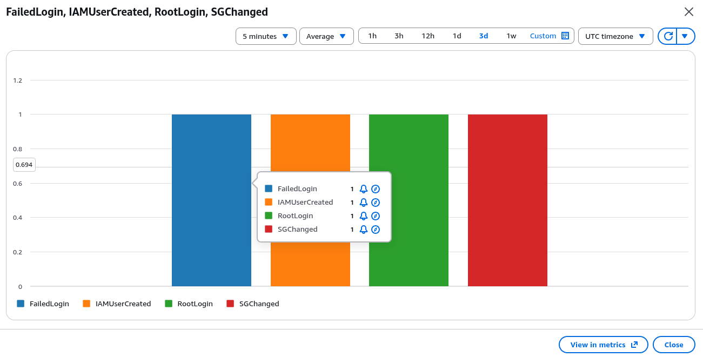

# AWS Mini SIEM - Laboratório de Monitoramento em Segurança Cloud AWS


## Visão Geral

Este projeto demonstra como construir uma solução leve no estilo SIEM utilizando serviços nativos da AWS dentro da Free Tier.

O ambiente captura logs de atividades da conta AWS, analisa eventos suspeitos e envia alertas automáticos por e-mail.

## Objetivos

- Monitorar atividades críticas da conta
- Detectar ações suspeitas em IAM
- Detectar uso da conta root
- Gerar alertas quase em tempo real
- Praticar conceitos de monitoramento em segurança cloud

---

## Arquitetura



```text
Atividade do Usuário
        ↓
   CloudTrail
   ↙       ↘
 S3   CloudWatch Logs
            ↓
     Metric Filters
            ↓
   CloudWatch Alarm
            ↓
           SNS
            ↓
   Alertas por Email
````
[Ver notas de arquitetura](arquitetura-do-projeto.md)

---

## Serviços AWS Utilizados

| Serviço          | Finalidade                                    |
| ---------------- | --------------------------------------------- |
| CloudTrail       | Captura atividades da conta e chamadas de API |
| S3               | Armazena logs históricos para auditoria       |
| CloudWatch Logs  | Centraliza logs                               |
| Metric Filters   | Detecta padrões suspeitos                     |
| CloudWatch Alarm | Dispara alertas                               |
| SNS              | Envia notificações por e-mail                 |
| IAM              | Gerenciamento de identidade e acesso          |

---

## Regras de Detecção

|Nome da Regra|Descrição|
|---|---|
|RootLogin|Detecta login no console usando conta root|
|IAMUserCreated|Detecta criação de novo usuário IAM|
|FailedLogin|Detecta múltiplas tentativas falhas de login|
|IAMPolicyChanged|Detecta mudanças de permissões IAM|
|SecurityGroupChanged|Detecta alterações em regras de entrada|

---

## Exemplos de Metric Filters

### Login Root

```json
{ $.userIdentity.type = "Root" && $.eventType = "AwsConsoleSignIn" }
```

### Criação de Usuário IAM

```json
{ $.eventName = CreateUser }
```

### Alteração de Security Group

```json
{ $.eventName = AuthorizeSecurityGroupIngress }
```

---

## Etapas de Implementação

1. Criado tópico SNS para notificações
    
2. Confirmada assinatura por e-mail
    
3. Habilitado CloudTrail
    
4. Envio dos logs do CloudTrail para CloudWatch Logs
    
5. Criação dos Metric Filters
    
6. Criação dos CloudWatch Alarms
    
7. Execução de eventos de teste
    
8. Validação dos alertas recebidos por e-mail

---

## Casos de Teste

| Cenário                    | Resultado Esperado | Status   |
| -------------------------- | ------------------ | -------- |
| Criar usuário IAM          | Alarme disparado   | Aprovado |
| Login root                 | Alarme disparado   | Aprovado |
| Alteração Security Group   | Alarme disparado   | Aprovado |
| Tentativas falhas de login | Alarme disparado   | Aprovado |

---
## Analise de Log RootLogin:

```
{
  "eventTime": "2026-04-27T18:48:42Z",
  "eventName": "ConsoleLogin",
  "userIdentity": {
    "type": "Root"
  },
  "sourceIPAddress": "XXX.XX.XXX.XX",
  "userAgent": "Mozilla/5.0 (Linux; x86_64) Chrome",
  "awsRegion": "us-east-1",
  "responseElements": {
    "ConsoleLogin": "Success"
  },
  "additionalEventData": {
    "MFAUsed": "Yes"
  },
  "eventType": "AwsConsoleSignIn"
}
```

## Análise de Evento: Login com Conta Root

### Resumo

Este log representa um login bem-sucedido no console da AWS utilizando a conta root.

[Ver análise completa - Login na conta Root](Docs/analise-de-log-root-login.md)

[Ver análise completa - Falha de Login](Docs/analise-de-log-falha-de-login.md)


----

## Resultados



O projeto gerou alertas automáticos com sucesso para quase todos os eventos relevantes de segurança na AWS.

- Monitoramento centralizado habilitado
    
- Alertas em tempo real configurados
    
- Trilha de auditoria armazenada em S3
    
- Fluxo básico de SIEM simulado


---

## Lições Aprendidas

- CloudTrail é essencial para visibilidade na AWS
    
- Mudanças em IAM devem ser monitoradas
    
- Uso da conta root representa alto risco
    
- CloudWatch permite detecções eficientes de baixo custo
    
- Serviços nativos AWS podem substituir SIEM básico em ambientes pequenos


[Ver notas de lições](Docs/licoes-aprendidas.md)
 


---

## Competências Demonstradas

- Fundamentos de Segurança AWS
    
- Monitoramento em Cloud
    
- Segurança IAM
    
- Alertas de Incidente
    
- Conceitos de Operações de Segurança

---

## Autor

Carol Savio - 
Projeto de Portfólio em Cloud Security
