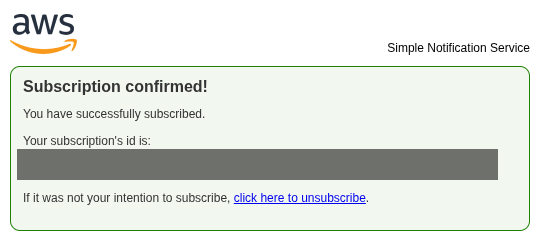

# Arquitetura do projeto

```
Atividade do usuário
     ↓
CloudTrail
 ↙        ↘
S3   CloudWatch Logs
         ↓
  Metric Filters
         ↓
 CloudWatch Alarms
         ↓
        SNS
         ↓
      Email

```

---

# Explicação por camada

## 1. Coleta de eventos — AWS CloudTrail

Tudo começa aqui.

- Registra eventos da conta (login, IAM, etc)
- Gera logs estruturados (JSON)

Exemplos:

- `RootLogin`
- `CreateUser`

---
## 2. Armazenamento — Amazon S3

- Guarda logs históricos
- Serve para auditoria e investigação futura

Não é usado para alerta em tempo real

---

## 3. Processamento em tempo real — Amazon CloudWatch Logs

- Recebe logs do CloudTrail
- Permite análise contínua

Aqui você começa a “detectar”

---
## 4. Detecção — Metric Filters

Exemplo de regras criadas:

```
RootLoginIAMUserCreatedFailedLogin
```

Esses filtros:

```
log → vira métrica numérica
```

Exemplo:

```
Se evento = CreateUser → soma +1
```

---
## 5. Avaliação — Amazon CloudWatch Alarms

- Monitora as métricas
- Define condição:

```
Se >= 1 → alerta
```

---
## 6. Notificação — Amazon SNS

- Recebe o evento do alarm
- Envia:

```
Email
```


---
# Passo a passo de implementação

## 1. Criar SNS

```
SNS → Create topic → Email subscription → Confirmar email
```


Exemplo da confirmação de e-mail.

---
## 2. Ativar CloudTrail

```
CloudTrail → Create trail→ Marcar:   ✔ Management events   ✔ Send to CloudWatch Logs→ Criar ou escolher Log Group
```

---
## 3. Criar Metric Filters

No CloudWatch Logs:

```
Log Group → Create metric filter
```

Exemplos:

### RootLogin

```
{ $.userIdentity.type = "Root" && $.eventType = "AwsConsoleSignIn" }
```

### CreateUser

```
{ $.eventName = CreateUser }
```

Namespace:

```
SecurityMetrics
```


---
## 4. Criar Alarms

```
CloudWatch → Alarms → Create alarm→ Select metric (custom namespace)→ Condition: >= 1→ Action: enviar para SNS
```

![[select-metric.png]]
Exemplo selecionando a métrica do `RootLogin'

---
## 5. Testar

- Criar usuário IAM
- Fazer login
- Errar login

---
## 6. Validar

- Métrica sobe
- Alarm entra em ALARM
- Email chega
